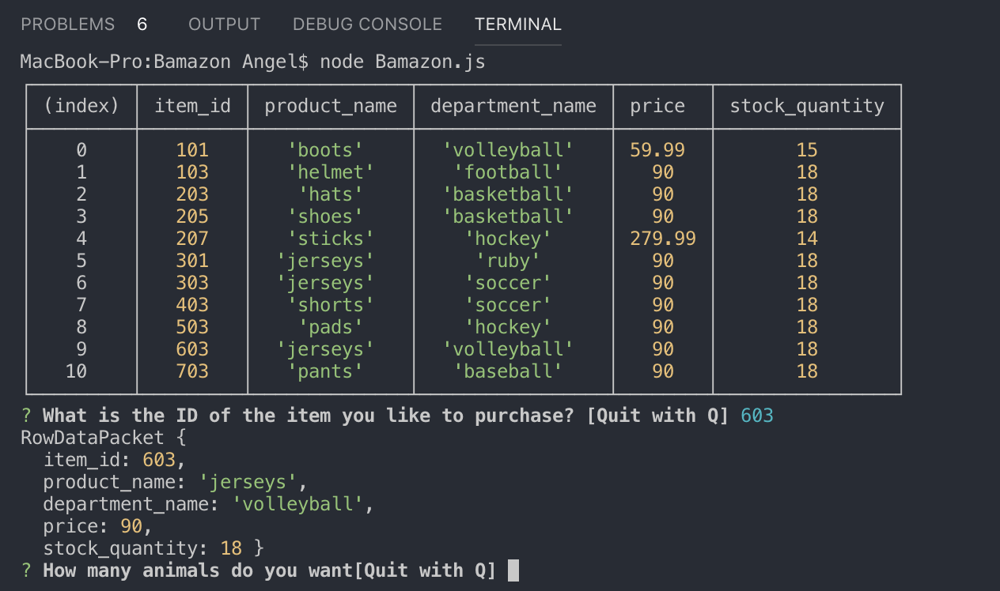
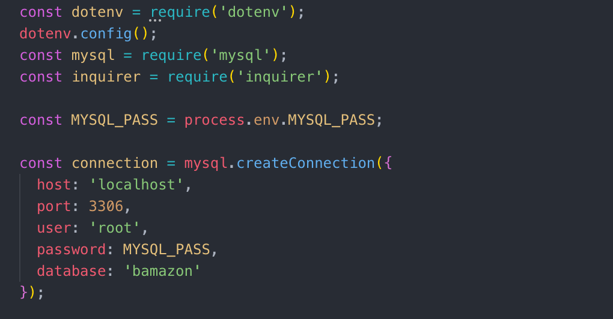
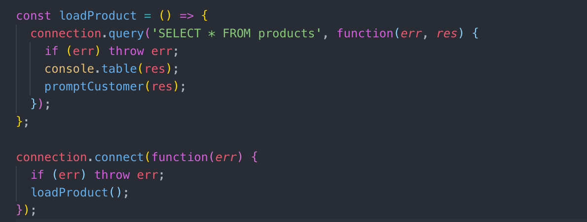

## OVERVIEW
> **Bamazon** is a CLI store-front with MYSQL BACK-END for an E-Commerce app(This shopping application enables users to select and purchase items from the inventory stored in a local database). The app will take in orders from customers and deplete stock from the store’s inventory that track every product sales across the store’s departments to provide a summary of the highest-grossing departments in the store.

## Third-Party Node Modules

> **Bamazon** uses a third-party node.js modules, it has it's own module, and connects to MYSQL database to store and retrieve > product and department information.
>
> The node modules I use in this app are: 
> console.table, mysql,inquirer.
> Install dependencies packages.

> **Packages Setup**
>>npm init => initialize package.json
>>npm install => create package-lock.json
>>npm i mysql => install mysql package
>>npm i inquirer => install inquirer package
>>npm i dotenv => install dotenv package

## What each Javascript does

> bamazon.js
>
>- Prints the products in the store
>- Prompts customer which product they would like to purchase by ID Number.
>- Asks for the quantity.
  * If there is a sufficient amount of the product in stock, it will return the total for that purchase.
  *However, if there is not enough of the product in stock, it will tell the user that there isn't enough of the item available.
  * If the purchase goes through, it update the stock quantity to reflect the purchase.
  * It will also update the product sales in the department table.
  
  Example:
  
  
  
## Technologies used

>- Node.js
>- Inquirer NPM package(https://www.npmjs.com/package/inquirer)
>- MYSQL NPM Package (https://www.npmjs.com/package/mysql)

* This is a node.js driver for mysql. It is written in JavaScript, does not require compiling, and is 100% MIT licensed.
* From this example, you can learn the following:

Example:

* From these examples, you can learn the following:

>- Every method you invoke on a connection is queued and executed in sequence.
>- Closing the connection is done using end() which makes sure all remaining queries are executed before sending a quit packet to the mysql server.

## Prerequisites

>- Node.js - Download the latest version of Node(https://nodejs.org/en/)
>- Create a MYSQL Database called "Bamazon", references of schema.sql and seeds.sql.

## Built With

- Visual Studio Code - Text Editor
- MySQL_Workbench
- Terminal/Gitbash

# Author

>-  **[Angel-Cochachez](https://github.com/codifyme/Bamazon/)**. JS/MYSQL/Node.js 

  
